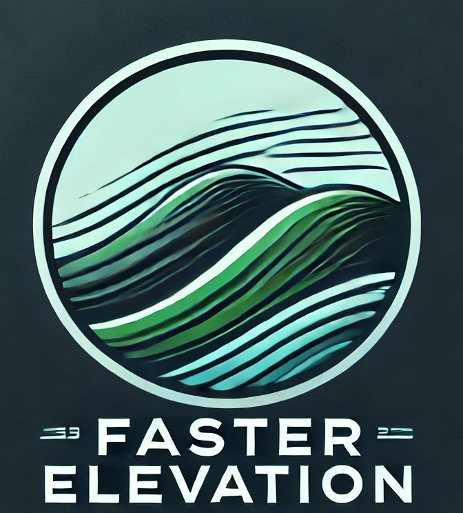

# Faster Elevation

A fork of [Open Elevation](https://github.com/waynevanson/open-elevation) written in Rust. 

## What is Faster Elevation?
Faster Elevation is a high-performance, open-source alternative to the Google Elevation API and other similar services. Built as a Rust-based fork of Open-Elevation, it brings enhanced speed, scalability, and flexibility to elevation data queries.

This project was created to provide an easy-to-deploy elevation API with support for modern datasets and advanced features. Faster Elevation supports a variety of GeoTIFF formats, including projections beyond EPSG 4326, and it includes a caching layer for optimal performance. Our service can handle up to 35,000 requests per second, making it suitable for demanding applications.

The project is simple to set up and offers a ready-to-use Docker image.
API Docs are available [here](docs/api.md).

Explore the full API documentation here, and learn more about Faster Elevation on our [website](https://faster-elevation.de).

